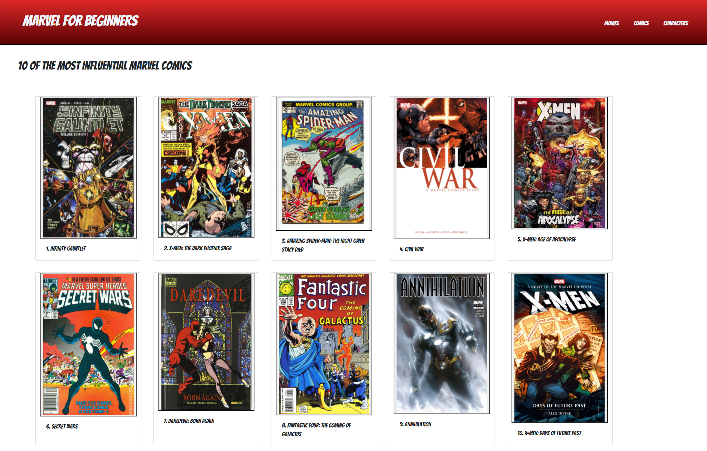

# Project1 Marvel For Beginners

A simple search app that utilizes both the Marvel and IMDB public API's. 

The app is designed to allow the user to search for any marvel character and receive a short bio, movies the character has been in, and comics the character has appeared in. Additional movie, character, and comic pages are provided that show the user some of the most popular marvel products in each category. 

The app utilizes local storage to show the user their previous 5 searches. A combination of bootstrap and CSS are used for styling. Page information is updated dynamically using JS.

This project was created in collaboration with:
Marissa Fandel (mfandel118)
Gavin Wentzel (gwentzel26)
David Davis (pdavisDU)

Screenshots of the application can be seen below:

The website is deployed here:
https://bhodge166.github.io/Project1_MarvelForBeginners/
